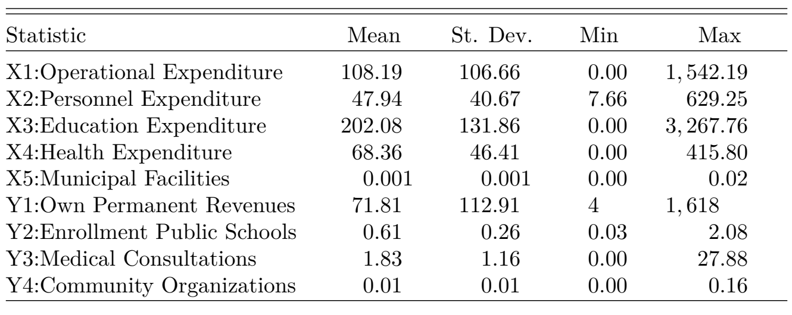
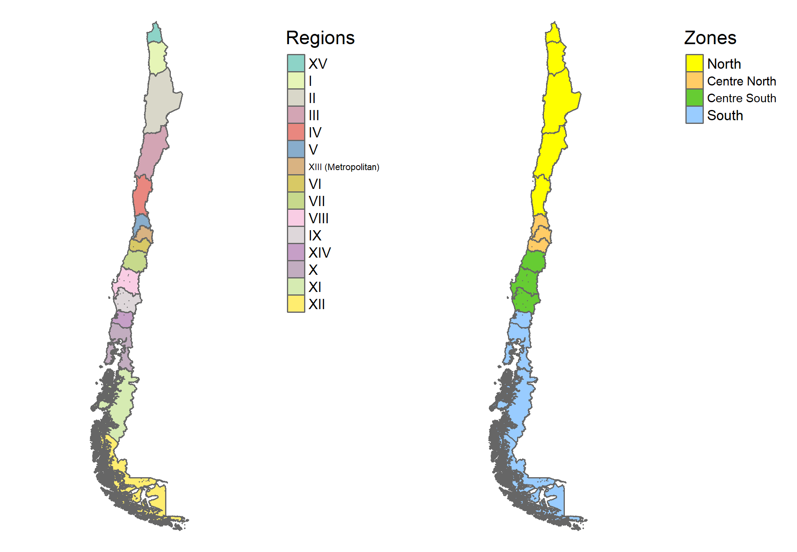
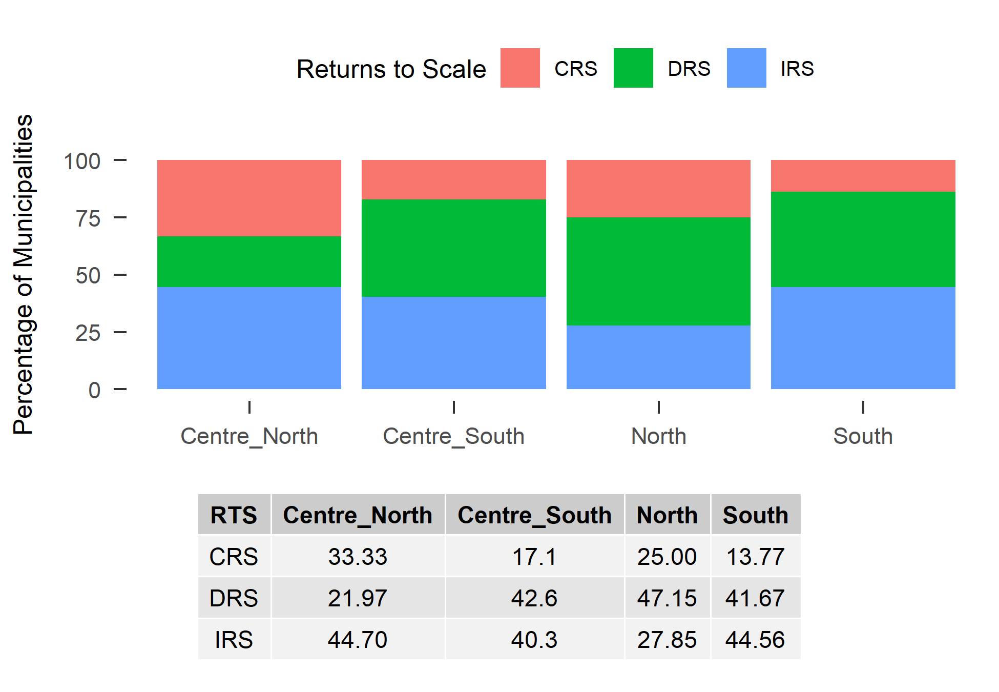
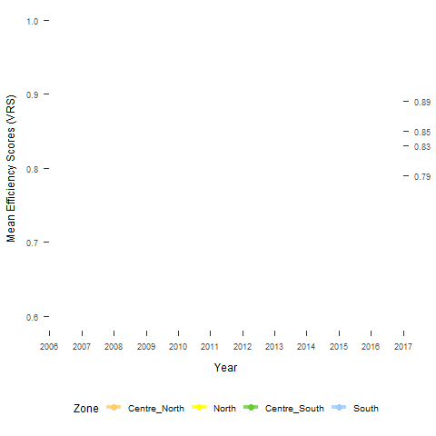
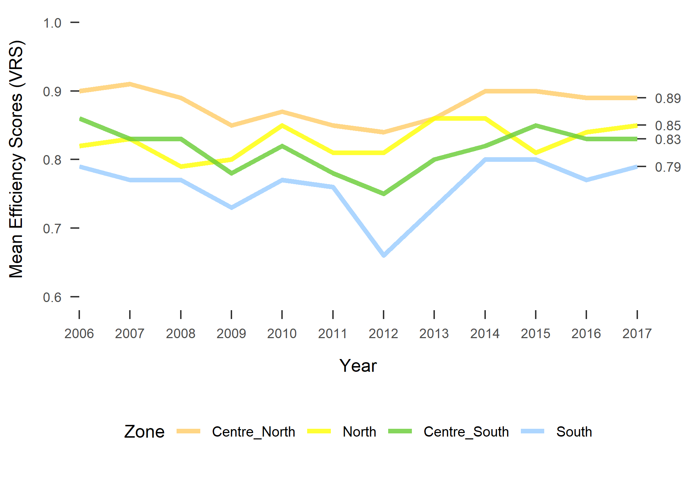
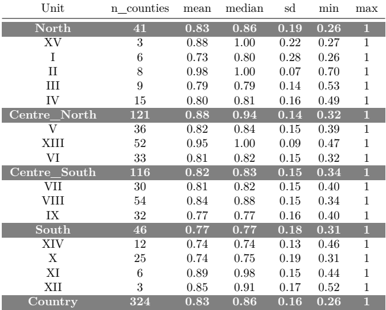
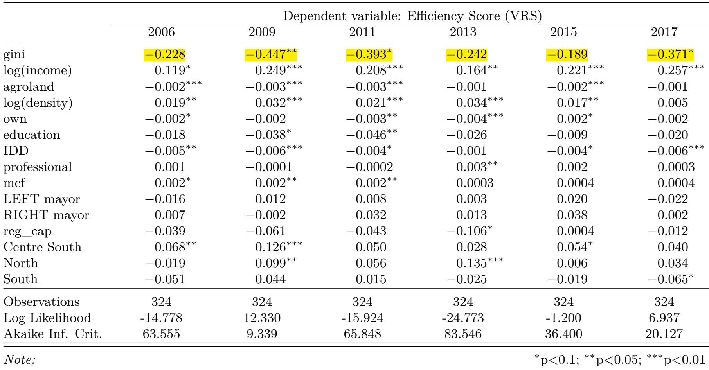
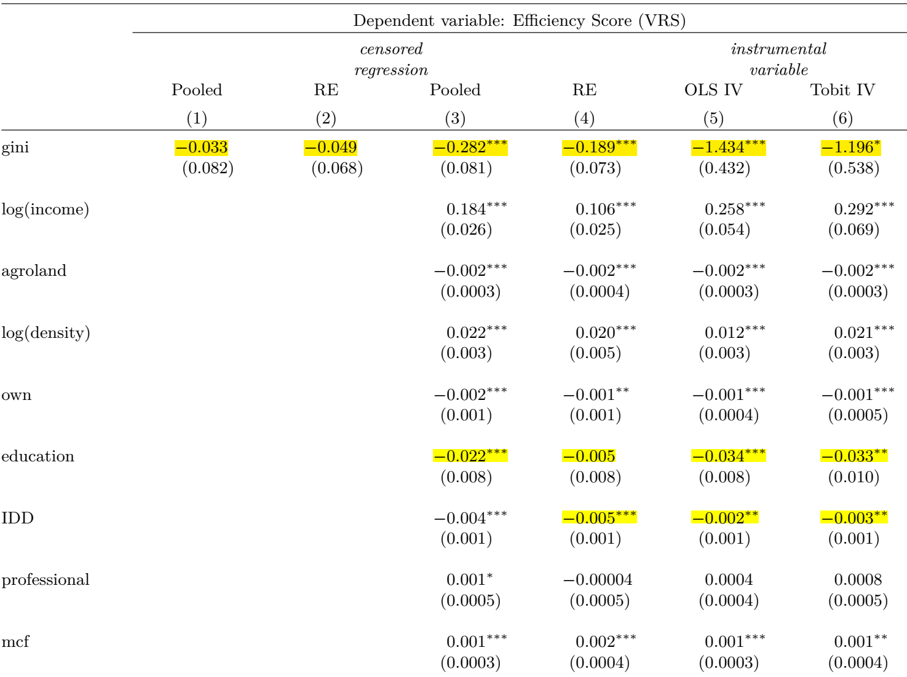
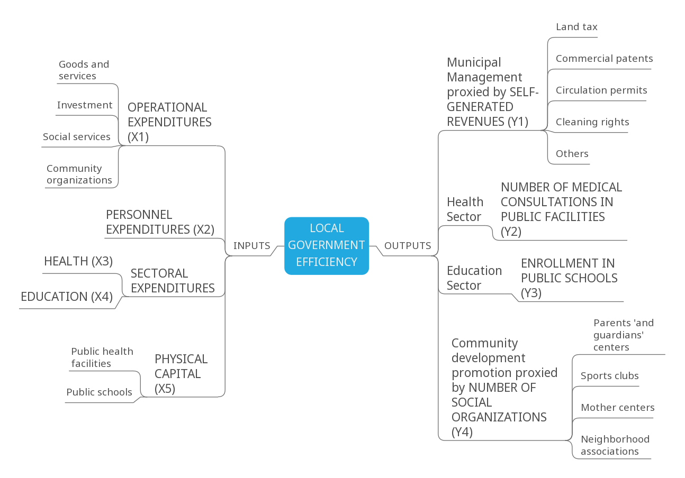
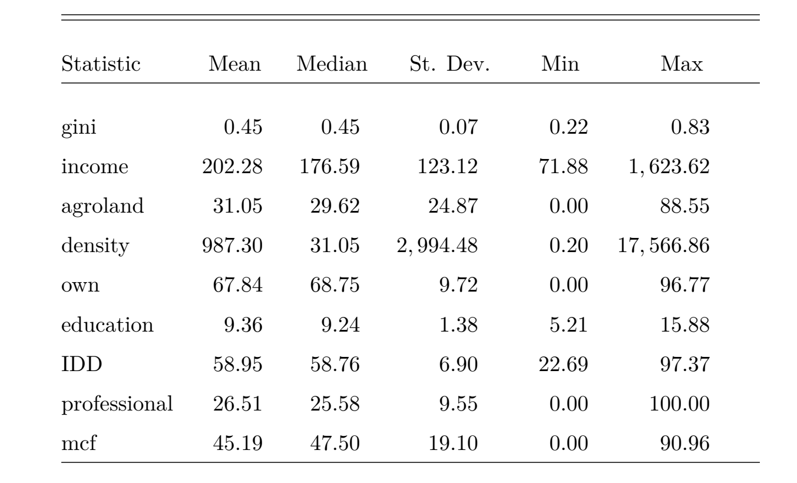

class: center, middle

# Motivation

--

Evidence on the **Trade-off** between **efficiency and equity** is not conclusive...

--

On the one hand ...

--

> Pursuing **equality can reduce efficiency** (see Okun 1975; Browning & Johnson 1984; Andersen & Maibom 2016)   

&NewLine;
--

On the other hand ...

--

> Equality **could also be an important ingredient in promoting and sustaining growth** (see Berg & Ostry 2011; kumhof, Rancière & Winant 2015)

--

### But this **trade-off** is commonly used as an argument against reforms that could help reduce inequalities

---
# Research so far

--

### **Local Government Efficiency (LGE)** studies have been focus on:
  
--

.pull-left[
### Measuring LGE
+ Single service vs overall efficiency
+ Parametric (SFA) vs **non-parametric (DEA)** techniques 
+ Input oriented vs output oriented
+ Selection of inputs and outputs
]

--
.pull-right[
### Explaining differences in LGE

+ Discretionary factors (inputs and outputs)
+ **Non-discretionary (contextual) factors**: Socio-economic, demographic, geographic, political, institutional, etc.
]

<div class="my-footer"><span>Local Government Efficiency 
&emsp;&emsp;&emsp;&emsp;&emsp;&emsp;&emsp;&emsp;&emsp;&emsp;&emsp;&emsp;&emsp;
&emsp;&emsp;&emsp;&emsp;&emsp;&emsp;&emsp;&emsp;&emsp;&emsp;&emsp;&emsp;&emsp;
</span></div> 

---
class: center, middle, inverse 
#Research Question

--

### What role does income inequality play in explaining differences in municipal efficiency? 

--

# Research Hypotheses

--

### Income inequality has a negative effect on municipal efficiency

---
# How could income inequality influence LGE?

--

Contextual factors, in general, could...

--
  + influence competition among municipalities

--

  + affect the degree of monitoring over local authorities
  
--

  + affect the degree of incentives to perform efficiently (Paradox of Plenty)

--

In the case of income inequality:

--

  + It is used to capture the degree of **heterogeneity in the demand for public services** that county population exerts over local authorities

--

  + Small **richest groups** can exert a higher **influence over local authorities** resulting in low quality and quantity of services for most of the county population.

--

  + It could be associated with a **lower monitoring and demand for an efficient performance** when is associated with a low average income.

<div class="my-footer"><span>Local Government Efficiency 
&emsp;&emsp;&emsp;&emsp;&emsp;&emsp;&emsp;&emsp;&emsp;&emsp;&emsp;&emsp;&emsp;
&emsp;&emsp;&emsp;&emsp;&emsp;&emsp;&emsp;&emsp;&emsp;&emsp;&emsp;&emsp;&emsp;
</span></div> 
---
name: data-DEA
# Data

### [Inputs - Outputs](#inputs-outputs) used to measure LGE  

+ National System of Municipal Information, SINIM (2006-2017)

--

+ Sample of 324 municipalities in 12 years (3888 observations)

--

### County-Level Data on [Contextual Factors](#EF)

--

+ National Socioeconomic Characterization Survey, CASEN (2006 - 2009 - 2011 - 2013 - 2015 - 2017)  

--

+ SINIM

--

+ "Servicio de Impuestos Internos", SII

--

+ National Institute of statistics, INE

--

+ in total 1944 observations (324 municipalities in 6 years)

<div class="my-footer"><span>Local Government Efficiency 
&emsp;&emsp;&emsp;&emsp;&emsp;&emsp;&emsp;&emsp;&emsp;&emsp;&emsp;&emsp;&emsp;
&emsp;&emsp;&emsp;&emsp;&emsp;&emsp;&emsp;&emsp;&emsp;&emsp;&emsp;&emsp;&emsp;
</span></div> 

---
class: center, middle, inverse

# Methodology
---
name: TSA
# Methodology: Two Stage Approach

--

### First Stage: DEA analysis

--

+ Input oriented assuming variable [returns to scale](#rts)
+ [Five inputs and four outputs](#inputs-outputs-summary).
+ Result: A vector of **efficiency scores (ES)** for each municipality

--

### Second Stage: Regression Analysis

--

+  **Dependent variable**: DEA efficiency scores 

--

+ **Independent variables**: Measure of Income inequality + remaining contextual factors including county (zone) specific and time fixed effects

--

+ **Estimation method**: Censored regression + Instrumental Variable (IV)

--

+ **Proposed Instrument**: $pss\_firms = \frac{\text{Number of firms in primary sector}}{\text{Total number of firms}}$

<div class="my-footer"><span>Local Government Efficiency 
&emsp;&emsp;&emsp;&emsp;&emsp;&emsp;&emsp;&emsp;&emsp;&emsp;&emsp;&emsp;&emsp;
&emsp;&emsp;&emsp;&emsp;&emsp;&emsp;&emsp;&emsp;&emsp;&emsp;&emsp;&emsp;&emsp;
</span></div> 

???
Challenges measuring LGE:

---
class: center, middle, inverse

# First Stage: DEA Results

---
class: center
name: inputs-outputs-summary

## Inputs and outputs used in [DEA](#TSA): Summary Statistics



<div class="my-footer"><span>Local Government Efficiency 
&emsp;&emsp;&emsp;&emsp;&emsp;&emsp;&emsp;&emsp;&emsp;&emsp;&emsp;&emsp;&emsp;
&emsp;&emsp;&emsp;&emsp;&emsp;&emsp;&emsp;&emsp;&emsp;&emsp;&emsp;&emsp;&emsp;
</span></div> 

---
class: center
## How do we capture geographical differences in LGE?



<div class="my-footer"><span>Local Government Efficiency 
&emsp;&emsp;&emsp;&emsp;&emsp;&emsp;&emsp;&emsp;&emsp;&emsp;&emsp;&emsp;&emsp;
&emsp;&emsp;&emsp;&emsp;&emsp;&emsp;&emsp;&emsp;&emsp;&emsp;&emsp;&emsp;&emsp;
</span></div> 

---
class: center
name: rts

## Returns to scale by zone

--



<div class="my-footer"><span>Local Government Efficiency 
&emsp;&emsp;&emsp;&emsp;&emsp;&emsp;&emsp;&emsp;&emsp;&emsp;&emsp;&emsp;&emsp;
&emsp;&emsp;&emsp;&emsp;&emsp;&emsp;&emsp;&emsp;&emsp;&emsp;&emsp;&emsp;&emsp;
</span></div> 

---
background-image: url(images/rts_six.png)
background-size: contain

---
name: es-evolution
class: center

### Evolution Efficiency Scores by Zone (Full Period) 



 <!--  --> 
 <!--  -->  


<div class="my-footer"><span>Local Government Efficiency 
&emsp;&emsp;&emsp;&emsp;&emsp;&emsp;&emsp;&emsp;&emsp;&emsp;&emsp;&emsp;&emsp;
&emsp;&emsp;&emsp;&emsp;&emsp;&emsp;&emsp;&emsp;&emsp;&emsp;&emsp;&emsp;&emsp;
</span></div> 
---
name: es
class: center

### Efficiency Scores by Zone and Region



.left[
+ **Mean efficiency** score is **0.83**.
+ So, **municipalities could, on average, reduce the use of inputs in 17%** to get the same level of outputs]
]
<div class="my-footer"><span>Local Government Efficiency 
&emsp;&emsp;&emsp;&emsp;&emsp;&emsp;&emsp;&emsp;&emsp;&emsp;&emsp;&emsp;&emsp;
&emsp;&emsp;&emsp;&emsp;&emsp;&emsp;&emsp;&emsp;&emsp;&emsp;&emsp;&emsp;&emsp;
</span></div> 
---
background-image: url(images/status_six.png)
background-size: contain

???
What if the determinants of efficiency are not the same as the determinants of inefficiency?
---
class: center, middle, inverse

# Second Stage

---
# The model

To test our hypothesis, the empirical model is defined as:  
<br>

\begin{equation}
\theta_{it} = \beta_1 gini_{it}+ Z_{it}\beta + \delta_{t} + \alpha_{i}+\epsilon_{it}
\end{equation}


Where:  

--

- $\theta_{it}$ is the vector of efficiency scores from the DEA analysis, 

- $gini_{it}$ is the Gini coefficient of each county, 

- $Z$ is a vector of controls.

- $\delta_t$ are year-specific effects, 

- $\alpha_i$ are municipality-specific constants, 

- $\epsilon_{it}$ is a vector of error terms and 


<div class="my-footer"><span>Local Government Efficiency 
&emsp;&emsp;&emsp;&emsp;&emsp;&emsp;&emsp;&emsp;&emsp;&emsp;&emsp;&emsp;&emsp;
&emsp;&emsp;&emsp;&emsp;&emsp;&emsp;&emsp;&emsp;&emsp;&emsp;&emsp;&emsp;&emsp;
</span></div> 
---

class: center

### Model Comparisons - Cross-sectional Censored Regressions

<center>

</center>

<div class="my-footer"><span>Local Government Efficiency 
&emsp;&emsp;&emsp;&emsp;&emsp;&emsp;&emsp;&emsp;&emsp;&emsp;&emsp;&emsp;&emsp;
&emsp;&emsp;&emsp;&emsp;&emsp;&emsp;&emsp;&emsp;&emsp;&emsp;&emsp;&emsp;&emsp;
</span></div> 

---
background-image: url(images/tab_panel_censc.png)
background-size: contain

---
class: center
#### Panel data regressions



<div class="my-footer"><span>Local Government Efficiency 
&emsp;&emsp;&emsp;&emsp;&emsp;&emsp;&emsp;&emsp;&emsp;&emsp;&emsp;&emsp;&emsp;
&emsp;&emsp;&emsp;&emsp;&emsp;&emsp;&emsp;&emsp;&emsp;&emsp;&emsp;&emsp;&emsp;
</span></div> 

---
## Main results and future research

--

**DEA**

--

  + The **"municipal production function"** shows variable returns to scale.

--

  + The **average level of inefficiency is 17%**, with higher levels in the South area of the country.

--

**Regression analysis**

--

  + Empirical **evidence of a negative relationship between inequality and efficiency**.

--

  + A **reduction of income inequality could have positive effects on economic efficiency**, at least at the **level of local governments**.

--

**Future research**

--

- **Spatial dependence-heterogeneity in LGE**. 

--

- Is the negative coefficient for _education_ explained by  the reduction in **electoral participation**? 

--

- What about the issue of **reverse causality?**

<div class="my-footer"><span>Local Government Efficiency 
&emsp;&emsp;&emsp;&emsp;&emsp;&emsp;&emsp;&emsp;&emsp;&emsp;&emsp;&emsp;&emsp;
&emsp;&emsp;&emsp;&emsp;&emsp;&emsp;&emsp;&emsp;&emsp;&emsp;&emsp;&emsp;&emsp;
</span></div> 

???
Probability not only about getting a technical efficient performance but also an scale efficient specifically.

interpretation: In the model without IV, the coefficient is around 0.25. This means that, if inequality fall in 4 points, efficiency should increase in only 1 point. But in the model with IV, the coefficient is around 1, so 4 less point in gini should be associated with and increase in efficiency in 4 (or more points). We are talking about long-term changes!
---

class: inverse, center, middle

# Thanks for Listening!

--

# Questions?


```{r pdf, eval=FALSE, include=FALSE}
pagedown::chrome_print("C:/Users/n9675230/OneDrive - Queensland University of Technology/R/gh-repos/final-seminar/index.Rmd")
```

---
class: center
name: inputs-outputs
## Appendix [1](#data-DEA)



---
class: center
name: EF
## Appendix 2

#### [Contextual Factors](#data-DEA): Summary Statistics


